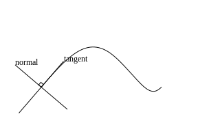
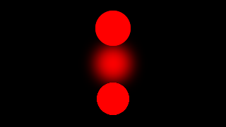
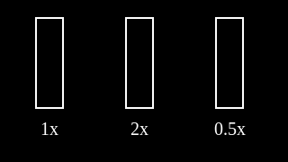
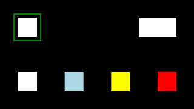
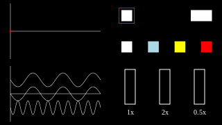
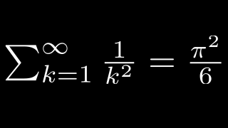

[](http://hackage.haskell.org/package/reanimate)
[](https://dev.azure.com/lemmih0612/reanimate/_build/latest?definitionId=1&branchName=master)

# reanimate

Reanimate is a reactive framework for creating non-interactive animations from SVG images.
This package consists of a set of combinators, a renderer (using ffmpeg), and a web-based
previewer. Inline latex code is supported when 'latex' and 'dvisvgm' are installed.

Nothing about the API is stable at this point.

Live coding playground: https://lemmih.github.io/reanimate/

# YouTube

Completed animations are uploaded to the [Reanimated Science](https://www.youtube.com/channel/UCbZujyI7i6JbI-I0shPvDgg) channel.

Animation snippets are uploaded to the [Reanimated Science Playground](https://www.youtube.com/channel/UCL7MwXLtQbhJeb6Ts3_HooA) channel.

# Getting started

Reanimate ships with a web-based viewer and automatic code reloading. To get a small demo
up and running, clone the repository, run one of the examples (this will install the library),
and wait for a browser window to open:

```console
$ git clone https://github.com/Lemmih/reanimate.git
$ cd reanimate/examples/
$ ./latex_color.hs
```

This should render the `latex_color` example in a new browser window. If you then change the
animation source code, the browser window will automatically reload and show the updated animation.

# TODO

* ~~website for live coding~~
* ~~bounding boxes~~
* ~~Use svg-tree instead of lucid-svg~~
* ~~crossplatform file watching~~
* Improve bounding box approximations
* Select desired FPS in web previewer
* Download rendered animations in web previewer
* Alignment and positioning combinators
* Consistent caching framework
* Figure out why performance doesn't scale linearly with more cores
* Test-suite: Compile and render all the example animations on the build servers. The SVG output should be stable.
* Driver:
   - ~~Command line options for rendering videos.~~
   - Flags for selecting fps in web viewer
   - Command for validating tools: latex, dvisvgm, ffmpeg. Warn of old versions of ffmpeg that don't render SVGs correctly.

# Examples

The example gifs are displayed at 25 fps. The source code for many of these examples are available
on the live coding playground.












